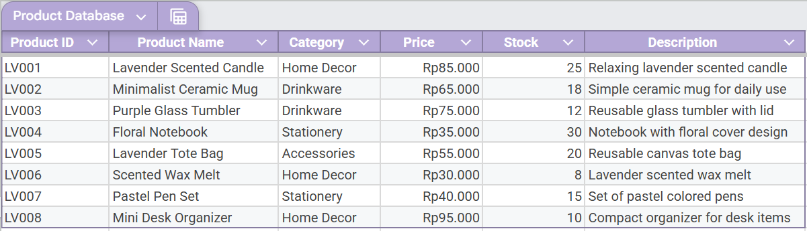
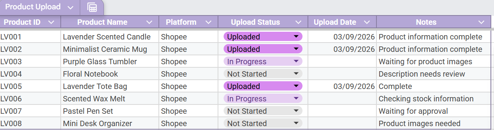
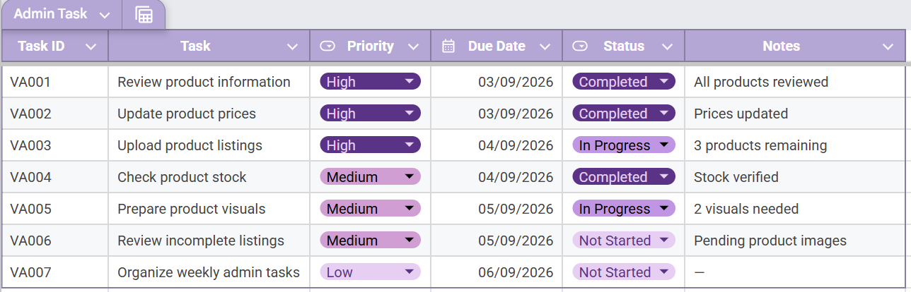
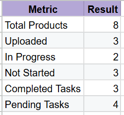

# Online Store VA Simulation

## Project Overview

This project is a beginner-level Virtual Assistant simulation created to practice organizing and managing administrative data for an online store.

The project simulates common VA tasks such as maintaining product information, tracking product uploads, and monitoring administrative tasks.

## Objectives

- Organize product information in a structured database
- Track product upload progress
- Manage daily administrative tasks
- Create a simple project summary for monitoring
- Practice using Google Sheets for administrative work

## Tools Used

- Google Sheets
- Microsoft Excel
- GitHub

## Project Components

### 1. Product Database

Contains product information including:

- Product ID
- Product Name
- Category
- Price
- Stock
- Description

### 2. Product Upload Tracker

Tracks the status of product uploads, including:

- Product name
- Platform
- Upload status
- Upload date
- Notes

### 3. Admin Task Tracker

Tracks administrative tasks based on:

- Task ID
- Task
- Priority
- Due date
- Status
- Notes

### 4. Project Summary

Provides a simple overview of project progress and task status.

## Skills Demonstrated

- Data entry
- Data organization
- Spreadsheet management
- Data tracking
- Basic Excel/Google Sheets formulas
- Conditional formatting
- Task management
- Administrative support

## Project Preview

### Product Database

### Product Upload Tracker

### Admin Task Tracker

### Project Summary

## Purpose

This project was created as a practice portfolio project to demonstrate beginner-level data entry and virtual assistant skills in an online store administration scenario.
